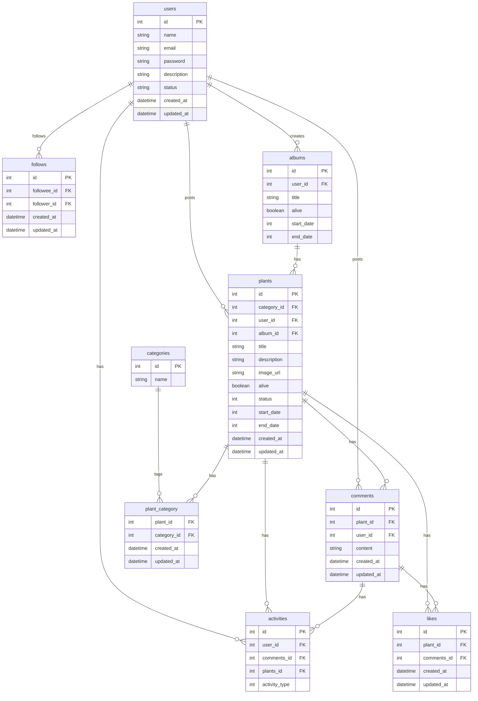

# ER図

```mermaid
erDiagram
    users ||--o{ follows : follows
    users ||--o{ albums : creates
    plants ||--o{ likes : has
    comments ||--o{ likes : has
    users ||--o{ plants : posts
    users ||--o{ comments : posts
    users ||--o{ activities : has
    categories ||--o{ plant_category : tags
    albums ||--o{ plants : has
    plants ||--o{ plant_category : has
    plants ||--o{ comments : has
    plants ||--o{ activities : has
    comments ||--o{ activities : has
    users {
        int id PK
        string name
        string email
        string password
        string description
        string status
        datetime created_at
        datetime updated_at 　
    }
    follows {
        int id PK
        int followee_id FK
        int follower_id FK
        datetime created_at
        datetime updated_at
    }
    albums {
        int id PK
        int user_id FK
        string title
        boolean alive
        int start_date
        int end_date
    }
    plants {
        int id PK
        int category_id FK
        int user_id FK
        int album_id FK
        string title
        string description
        string image_url
        boolean alive
        int status
        int start_date
        int end_date
        datetime created_at
        datetime updated_at
    }
    likes {
        int id PK
        int plant_id FK
        int comments_id FK
        datetime created_at
        datetime updated_at
    }
    comments {
        int id PK
        int plant_id FK
        int user_id FK
        string content
        datetime created_at
        datetime updated_at
    }
    categories {
        int id PK
        string name
    }
    plant_category {
        int plant_id FK
        int category_id FK
        datetime created_at
        datetime updated_at
    }
    activities {
        int id PK
        int user_id FK
        int comments_id FK
        int plants_id FK
        int activity_type 
    }
```
