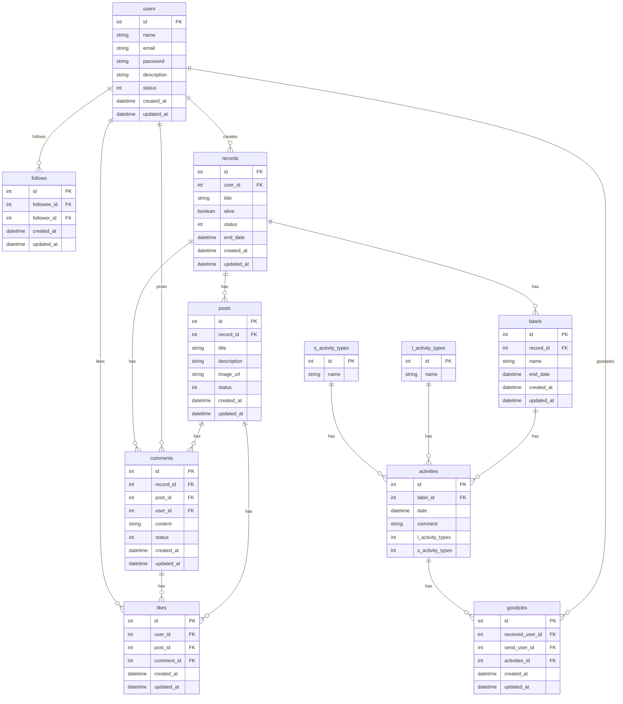

# ER図

```mermaid
erDiagram
    users ||--o{ follows : follows
    users ||--o{ records : creates
    posts ||--o{ likes : has
    posts ||--o{ comments : has
    comments ||--o{ likes : has
    users ||--o{ likes : likes
    users ||--o{ goodjobs : goodjobs
    users ||--o{ comments : posts
    records ||--o{ posts : has
    records ||--o{ labels : has
    records ||--o{ comments : has
    labels ||--o{ activities : has
    activities ||--o{ goodjobs : has
    l_activity_types ||--o{ activities : has
    s_activity_types ||--o{ activities : has
    users {
        int id PK
        string name
        string email
        string password
        string description
        int status
        datetime created_at
        datetime updated_at 
    }
    follows {
        int id PK
        int followee_id FK
        int follower_id FK
        datetime created_at
        datetime updated_at
    }
    records {
        int id PK
        int user_id FK
        string title
        boolean alive
        int status
        datetime end_date
        datetime created_at
        datetime updated_at
    }
    labels {
        int id PK
        int record_id FK
        string name
        datetime end_date
        datetime created_at
        datetime updated_at
    }
    posts {
        int id PK
        int record_id FK
        string title
        string description
        string image_url
        int status
        datetime created_at
        datetime updated_at
    }
    likes {
        int id PK
        int user_id FK
        int post_id FK
        int comment_id FK
        datetime created_at
        datetime updated_at
    }
    comments {
        int id PK
        int record_id FK
        int post_id FK
        int user_id FK
        string content
        int status
        datetime created_at
        datetime updated_at
    }
    activities {
        int id PK
        int label_id FK
        datetime date
        string comment
        int l_activity_types
        int s_activity_types
    }
    goodjobs {
        int id PK
        int received_user_id FK
        int send_user_id FK
        int activities_id FK
        datetime created_at
        datetime updated_at
    }
    l_activity_types {
        int id PK
        string name
    }
    s_activity_types {
        int id PK
        string name
    }
```
