# 概要
Spring Bootで開発されたbotapeerのバックエンドAPIです。

# アプリケーションアーキテクチャ
基本的にはクリーンアーキテクチャの思想を参考に開発されたプロジェクトです。


黄色い部分のEnterpisse Business Rulesにはビジネスロジックが書かれています。このプロジェクトではdomain層にある各サービスやドメインモデルがそれにあたります。  
赤い部分のApplication Business Rulesにはユースケース（アプリケーションロジック）が書かれています。このプロジェクトではusecase層がそれにあたります。
usecase層はdomain層に依存し、ワークフローやビジネスロジックを実行する役割を持ちます。


ディレクトリ構造をなるべくシンプルにすると以下のようになります。
```
├── src
│   ├── main
│   │   ├── java
│   │   │   └── com
│   │   │       └── botapeer
│   │   │           ├── adapter
│   │   │           ├── config
│   │   │           ├── constants
│   │   │           ├── controller
│   │   │           │   └── payload
│   │   │           │       └── label
│   │   │           ├── domain
│   │   │           │   ├── model
│   │   │           │   │   ├── label
│   │   │           │   │   ├── like
│   │   │           │   │   ├── place
│   │   │           │   │   ├── plantRecord
│   │   │           │   │   ├── post
│   │   │           │   │   ├── text
│   │   │           │   │   └── user
│   │   │           │   ├── repository
│   │   │           │   ├── adapter
│   │   │           │   └── service
│   │   │           │       └── interfaces
│   │   │           ├── exception
│   │   │           ├── infrastructure
│   │   │           │   ├── entity
│   │   │           │   ├── mapper
│   │   │           │   └── repository
│   │   │           │       └── dto
│   │   │           │           ├── like
│   │   │           │           ├── place
│   │   │           │           ├── plantRecord
│   │   │           │           ├── post
│   │   │           │           └── user
│   │   │           ├── security
│   │   │           ├── usecase
│   │   │           │   ├── dto
│   │   │           │   │   ├── place
│   │   │           │   │   ├── plantRecord
│   │   │           │   │   ├── post
│   │   │           │   │   └── user
│   │   │           │   └── interfaces
│   │   │           └── util

```


# ER図

```mermaid
erDiagram
    users ||--o{ follows : follows
    users ||--o{ plant_records : creates
    users ||--o{ likes : likes
    users ||--o{ goodjobs : goodjobs
    users ||--o{ comments : posts
    users ||--o{ activity_records : creates
    posts ||--o{ likes : has
    posts ||--o{ comments : has
    comments ||--o{ likes : has
    comments ||--o{ comments : has
    l_activity_types ||--o{ s_activity_types : has
    s_activity_types ||--o{ activities : types
    plant_records ||--o{ activities : has     
    plant_records ||--o{ posts : has
    places ||--o{ plant_records : has
    activity_records ||--o{ goodjobs : has
    activity_records ||--o{ activities : has
    activity_records ||--o{ comments : has
    users {
        int id PK
        string name
        string email
        string password
        string description
        int status
        datetime created_at
        datetime updated_at 
    }
    follows {
        int id PK
        int followee_id FK
        int follower_id FK
        datetime created_at
        datetime updated_at
    }
    plant_records {
        int id PK
        int user_id FK
        int place_id FK
        string title
        boolean alive
        int status
        datetime end_date
        datetime created_at
        datetime updated_at 
    }
    places {
        int id PK
        string name
        datetime created_at
        datetime updated_at
    }
    posts {
        int id PK
        int plant_record_id FK
        string title
        string article
        string image_url
        int status
        datetime created_at
        datetime updated_at
    }
    likes {
        int id PK
        int user_id FK
        int post_id FK
        int comment_id FK
        datetime created_at
        datetime updated_at
    }
    comments {
        int id PK
        int post_id FK
        int user_id FK
        int comment_id FK
        string content
        int status
        datetime created_at
        datetime updated_at
    }
    activity_records {
        int id PK
        int user_id FK
        string image_url 
        string article 
        int status
        datetime created_at
        datetime updated_at
    }
    activities {
        int id PK
        int plant_record_id FK
        int activity_record_id FK
        int s_activity_types_id FK
        int status     
        datetime created_at
        datetime updated_at
    }
    goodjobs {
        int id PK
        int received_user_id FK
        int send_user_id FK
        int activity_record_id FK     
        datetime created_at
        datetime updated_at
    }
    l_activity_types {
        int id PK
        string name
    }
    s_activity_types {
        int id PK
        int l_activity_type_id FK
        string name
    }
```

