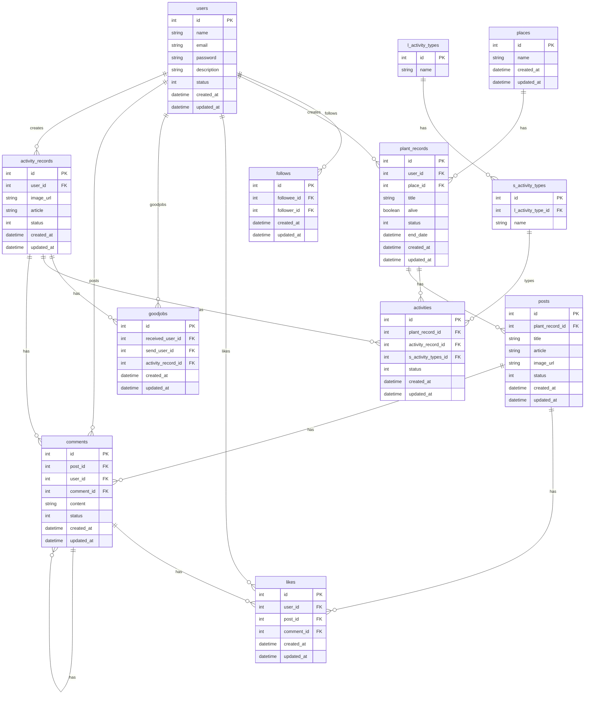

# 概要
Spring Bootで開発されたbotapeerのバックエンドAPIです。

## アプリケーションアーキテクチャ
基本的にはクリーンアーキテクチャの思想を参考に開発されたプロジェクトです。


### 黄色い部分
Enterpisse Business Rulesにはビジネスロジックが書かれています。このプロジェクトではdomain層にある各サービスやドメインモデルや値オブジェクトがそれにあたります。  
### 赤い部分
Application Business Rulesにはユースケース（アプリケーションロジック）が書かれています。このプロジェクトではusecase層がそれにあたります。
usecase層はdomain層に依存し、ワークフローやビジネスロジックを実行する役割を持ちます。
### 緑の部分
Interfaces Adaptersは外部との接続を繋ぐ役割を持ちます。例えば、repositoryのインターフェース、そしてそれを実装したinfrastructureのコードによってDBに接続するためのゲートウェイの役割を待たすことができます。他にこのプロジェクトで利用されている層はadapter層にて、S3に画像をアップロードするのに利用されています。主に外部への依存関係を切り離すための役割を持たせています。
### 青の部分
Frameworks & Driversはアプリケーション外部と実際に接続するための役割をもちます。その名の通り、フレームワークやドライバです。

上記のような認識として、開発をすすめていきました。

ディレクトリ構造をなるべくシンプルにすると以下のようになります。
```
├── src
│   ├── main
│   │   ├── java
│   │   │   └── com
│   │   │       └── botapeer
│   │   │           ├── adapter
│   │   │           ├── config
│   │   │           ├── constants
│   │   │           ├── controller
│   │   │           │   └── payload
│   │   │           │       └── label
│   │   │           ├── domain
│   │   │           │   ├── model
│   │   │           │   │   ├── label
│   │   │           │   │   ├── like
│   │   │           │   │   ├── place
│   │   │           │   │   ├── plantRecord
│   │   │           │   │   ├── post
│   │   │           │   │   ├── text
│   │   │           │   │   └── user
│   │   │           │   ├── repository
│   │   │           │   ├── adapter
│   │   │           │   └── service
│   │   │           │       └── interfaces
│   │   │           ├── exception
│   │   │           ├── infrastructure
│   │   │           │   ├── entity
│   │   │           │   ├── mapper
│   │   │           │   └── repository
│   │   │           │       └── dto
│   │   │           │           ├── like
│   │   │           │           ├── place
│   │   │           │           ├── plantRecord
│   │   │           │           ├── post
│   │   │           │           └── user
│   │   │           ├── security
│   │   │           ├── usecase
│   │   │           │   ├── dto
│   │   │           │   │   ├── place
│   │   │           │   │   ├── plantRecord
│   │   │           │   │   ├── post
│   │   │           │   │   └── user
│   │   │           │   └── interfaces
│   │   │           └── util

```

## バリデーション
Bean Validationを利用しています。
Open APIリポジトリで定義され、openapi-generatorを通して自動生成されたモデルを利用しているため、バリデーションはコントローラ層でまず行われます。  
そのため、パラメータの異常値はバリデーションエラーとなり、例外が投げられます。  
また、ビジネスロジックを実行するサービス層、ユースケース層でもそれぞれバリデーションを行っています。  
単体テストではバリデーションも含めて、異常系のテストを行なっています。  

## 単体テスト
JUnit5、モックライブラリにはMockitoを利用して行います。
Mavenのテストディレクトリ、src/test/javaにテスト用のファイルを置いています。  
それぞれのディレクトリとクラスはsrc/main/javaに対応しています。  
テストコードを実行するにはmake upコマンドでDockerコンテナを立ち上げた状態で、make testとすることでテストが実行されます。  
makefileにはビルドやコンテナ実行用のコマンドを記述しているので、そのほかのコマンドもご参照ください。  

## データベース
MySQLを利用しています。開発環境ではdocker-composeで定義されたDBがサービスとして立ち上がります。  
infrastructure層でDBのアクセスをする処理を行います。OR MapperはMyBatisです。  

### ER図
マーメイドを利用して設計しています。単に図を書きたい時はサクッと書けて便利です。  
エンティティの中には設計しただけで実装されていないものも含まれています。



## 認証
認証はSpring Securityを使用しています。  
config/SecurityConfig.javaでセキュリティに関する設定を行なっています。
/apiがAPIのルートパスになります。ルートパス以降のGETでの呼び出しは全て許可しており、それ以外のAPIは認証時のみ利用可能です。  
ただし、例外的に/api/authだけはユーザー作成やログインのために、POSTを呼び出す必要があるため認証をせずに呼び出すことができます。
